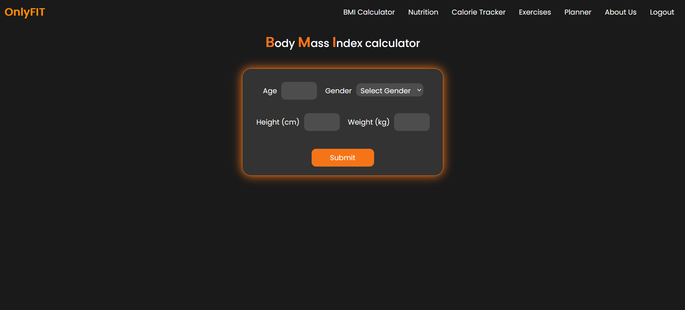
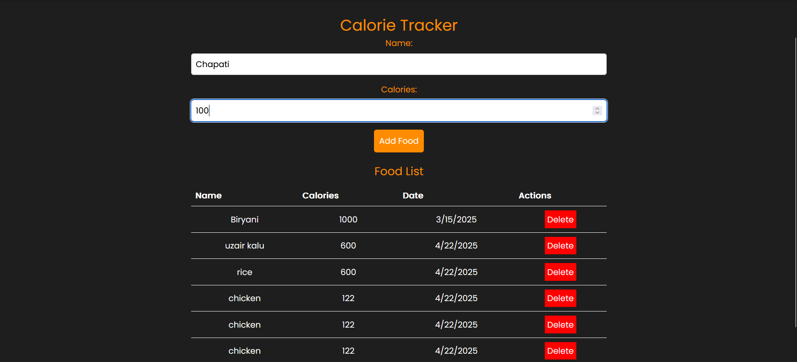
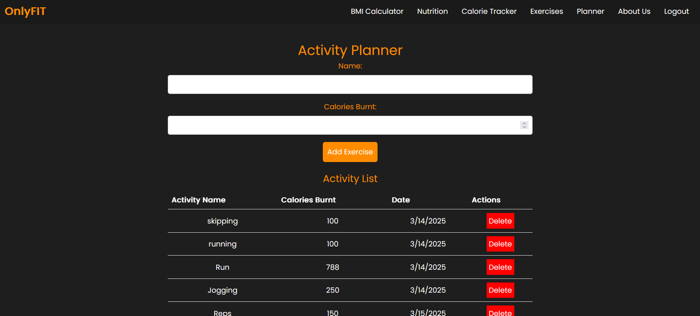
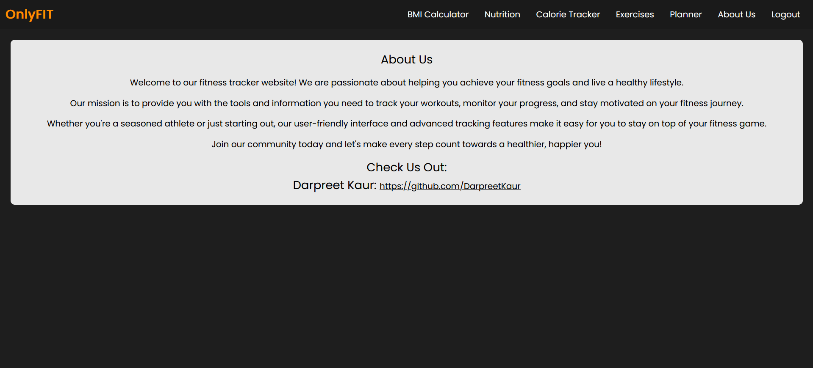

# 🏋️ Fitness Tracker App

A full-stack **Fitness Tracker** built using the **MERN stack** (MongoDB, Express.js, React.js, Node.js) to help users track their workouts, goals, and fitness journey in one place.

---

## 🚀 Features

- User login and registration
- Add, update, and delete workouts
- Track exercise duration and calories burned
- View past fitness history
- Responsive and clean UI with React

---

## 📦 Tech Stack

- **Frontend**: React.js, React Router
- **Backend**: Node.js, Express.js, MongoDB, Mongoose
- **Authentication**: JWT, bcrypt
- **Database**: MongoDB Atlas / Local MongoDB

---

## 🔧 Installation & Setup

1. Open Command Prompt or Terminal.

2. Clone the repository:

git clone https://github.com/your-username/fitness-tracker.git

3. Navigate to the project directory:

cd fitness-tracker

4. Move to the backend directory:

cd Server

5. Install backend dependencies:

npm install

6. Install environment variable manager:

npm install dotenv

7. Move to the frontend directory:

cd ../Client

8. Install frontend dependencies:

npm install

9. Create an environment configuration file:
In the /Server folder, create a .env file and add the following:

env

PORT=3000
MONGO_URI=your_mongodb_connection_string
JWTPRIVATEKEY=your_super_secret_key

10. Go back to the project root:

cd ..

11. Run the backend server:

cd Server
npm start

12. Run the frontend server:
Open a new terminal and run:

cd Client
npm start

## Screenshots

